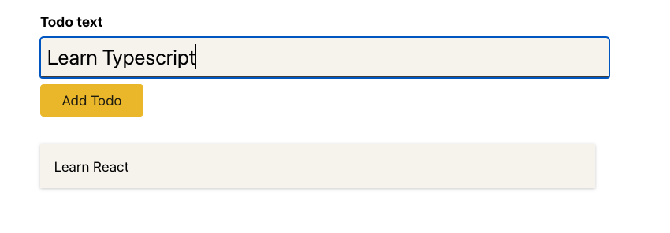

# To Do App

A very basic to do app built using React and Typescript, where users can add tasks and remove them by clicking on them.



## Tech stack

**Frontend:**


## Quickstart

### Set up your project

1. Fork this repository
2. Clone your fork to your local machine
3. Install Node.js dependencies

   ```bash
   npm install
   ```

4. Install an ESLint plugin for your editor (optional). For example: [`linter-eslint`](https://github.com/AtomLinter/linter-eslint) for Atom.

### Start the server

1. Start the front end application

   ```bash
   npm start
   ```
